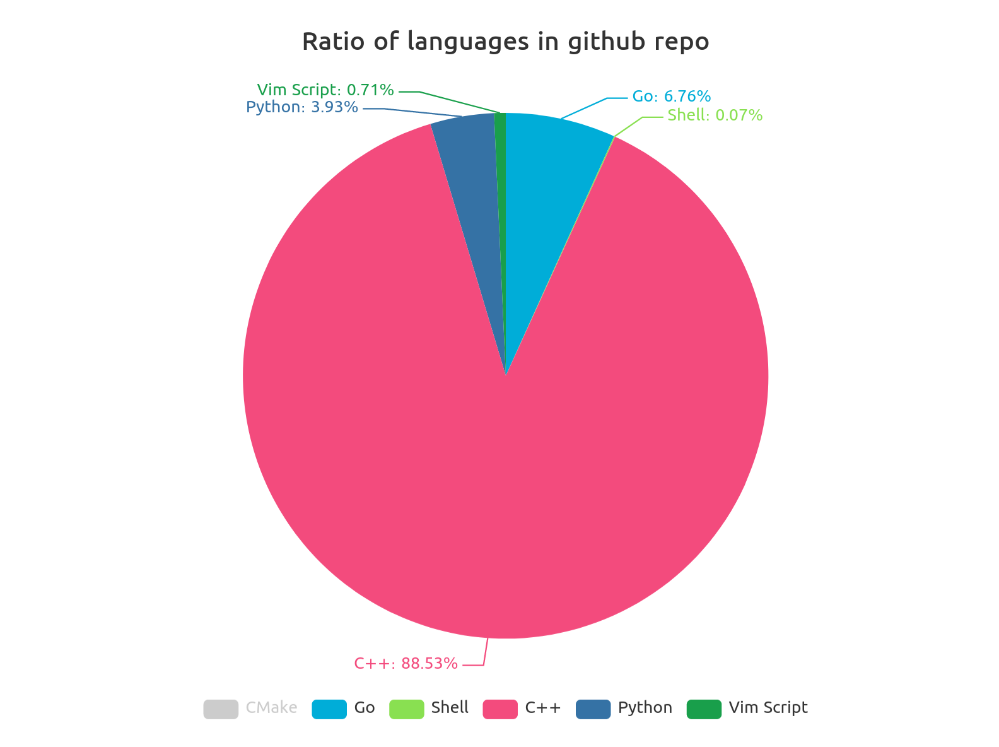

# makhzan

makhzan is a github repo analyzer


## installation

```
go get github/mo1ein/makhzan
```

## Run
```
go run main.go
```

And open generated file:

```
xdg-open langPieChart.html
```
<p align = "center"></p>

## Contribute
Just send PR! That's very enjoyable for me if you contribute. :-) 
